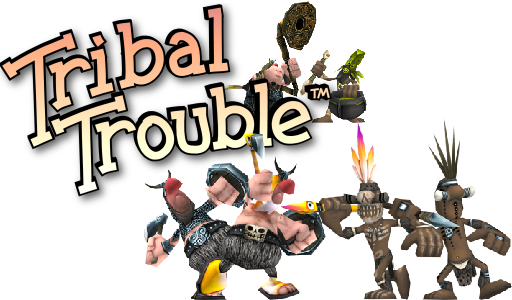
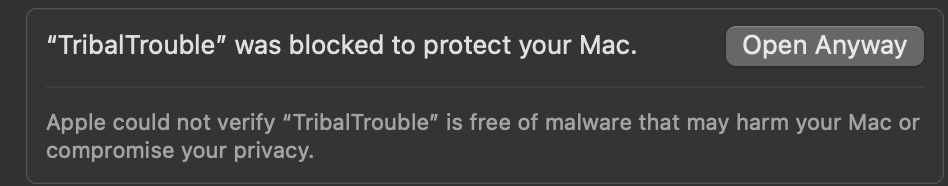

# Tribal Trouble



[](LICENSE)
[](https://github.com/OmarAMokhtar/tribaltrouble/actions/workflows/gradle.yml?query=branch%3Amain)
[](https://discord.gg/tribaltrouble?style=flat)

Tribal Trouble is a realtime strategy game released by Oddlabs in 2004. In 2014 the source was released under GPL2 license.

This fork aims to:

1. Bring the game back online and make it available for everyone to play as it was originally✅
2. Ensure it is easy to build and contribute to development of the game 🚧
3. Remaster and modernize the graphics 🚧
4. Add more playable features later 🚧

See what we're working on right now on the **[current roadmap](https://github.com/users/OmarAMokhtar/projects/1)**.

## Table of Contents

- [🎮 How to play?](#-how-to-play)
- [🛠️ Build Requirements](#️-build-requirements)
- [🏗️ Building](#️-building)
  - [Repository Setup](#repository-setup)
  - [Build + Run Game Client](#build--run-game-client)
  - [Build Game Client for Distribution](#build-game-client-for-distribution)
  - [Build + Run Game Server](#build--run-game-server)
  - [Common Gradle Tasks](#common-gradle-tasks)
- [🚀 Releasing](#-releasing)
  - [Versioning](#versioning)
  - [Branches & CI Behavior](#branches--ci-behavior)
  - [How to Cut a Release](#how-to-cut-a-release)
  - [Steam Setup](#steam-setup)
  - [itch.io Setup](#itchio-setup)
- [🤝 Contributing](#-contributing)
- [🙏 About this fork](#-about-this-fork)

## 🎮 How to play?

The easiest way to play is on **[Steam - Tribal Trouble: Resurrected](https://store.steampowered.com/app/3945720/Tribal_Trouble_Resurrected/)**. You can also grab a build from [tribaltrouble.org](https://tribaltrouble.org) or the releases section of this repo. Come join us on [discord](https://discord.gg/tribaltrouble) - we're still a small community!

Builds from this repo (outside of Steam) are unsigned, so different OSes will respond differently when you launch:

- Linux
  - Launch the `TribalTrouble-x86_64.AppImage`
- Windows
  - Launch the `TribalTrouble.exe`
  - A windows defender modal will pop up. Click more info > run anyway
- Mac
  - Launch the application
  - A modal appears warning the application is unsigned and should be moved to the trash. Click done
  - Go to system settings > Privacy & Security and click Open Anyway:
    

## 🛠️ Build Requirements

### Client + Server

- [Java SDK 26](https://www.oracle.com/java/technologies/downloads/) (or Open-JDK-26)
- The bundled Gradle wrapper (`./gradlew` / `gradlew.bat`)

### Server

- [mySQL](https://dev.mysql.com/downloads/mysql/)

## 🏗️ Building

Each instruction below assumes you are in a terminal at the root of the repository. Examples use `./gradlew`; on Windows use `gradlew.bat` (or `.\gradlew.bat`) instead.

### Repository Setup

This repo ships a `.gitconfig` with a `.git-blame-ignore-revs` file so the mass-reformat commits don't pollute `git blame`. Git won't auto-load it for security reasons. Run this once from the project root after cloning:

```bash
git config --local include.path ../.gitconfig
```

### Build + Run Game Client

- `./gradlew tt:run`

> Steam integration is optional at runtime: `tt:run` works fine without Steam installed or running. If the Steam client is running and `tt/steam_appid.txt` is present (it's committed to the repo), the game will use Steam features (rich presence, achievements, etc.) where it can.

### Build Game Client for Distribution

Build output lands under `tt/build/dist/<platform>` (with shared staged files in `tt/build/dist/common`).

- Linux
  - `./gradlew tt:packageLinux`
- Windows
  - `gradlew.bat tt:packageWindows`
- Mac x86
  - `./gradlew tt:packageMacX86`
- Mac arm64
  - `./gradlew tt:packageMacArm64`

> Each `package*` task only runs on its matching host OS `packageWindows` skips on Linux/Mac, and vice versa.

> Don't want to build locally? CI builds per-platform artifacts on every push to `main` and `release`. Grab them from the [Actions tab](https://github.com/OmarAMokhtar/tribaltrouble/actions/workflows/gradle.yml) — pick a successful run and download the platform artifact you want at the bottom of the page.

### Build + Run Game Server

1. mySQL Setup
    - Run `initmysql.sql` against your MySQL server this creates the `oddlabs` database and all base tables.
    - Create the `matchmaker` user and grant it access to the `oddlabs` database (pick any password remember it for the next step):

      ```sql
      CREATE USER 'matchmaker'@'localhost' IDENTIFIED BY '<your-password>';
      GRANT ALL PRIVILEGES ON oddlabs.* TO 'matchmaker'@'localhost';
      FLUSH PRIVILEGES;
      ```

    - Run each migration script in `database/` in numeric order (`001` → `002` → `003` → `004`). They assume you're already in the `oddlabs` database.

2. Server Configuration
    - Copy `server/server.properties.template` to `server/server.properties`
    - Edit the `server.properties` file with your configuration:
      - `SQL_PASS`* - The password for the matchmaker database user
      - `DISCORD_BOT_TOKEN` - Your Discord bot token
      - `DISCORD_SERVER_ID` - Your Discord server ID
      - `WEBSITE_DOMAIN` - Your website domain
      - `NATIVE_CHIEF_EMOJI` and `VIKING_CHIEF_EMOJI` - Emoji IDs for game factions
      - `EMOJI_ROLE_MAPPINGS` - JSON array for Discord role mappings
        > Example: [{"role id":"\<numeric discord role id>","emoji id":"<custom emoji id or unicode (U+1F602)>"}]
      - `REACTION_ROLE_MESSAGE_ID` - Discord message ID for reaction roles

    > Those marked with \* are required to run the game server. Those without \* are optional settings. That are generally used for things like discord integration

3. Run the servers
     - There are two main servers needed. The matchmaker and the router. The matchmaker is what runs the game and most the server logic. The router sends and receives chat messages and other messages from the client
     - **For dev** (foreground, console logs, picks up `server/server.properties`):
       - Matchmaker: `./gradlew server:runMatchmaker`
       - Router: `./gradlew server:runRouter`
     - **For deployment** — extract the server bundle (grab it from the [Actions tab](https://github.com/OmarAMokhtar/tribaltrouble/actions/workflows/gradle.yml) under the `server` artifact), edit `server.properties` in the extracted root, then launch via `bin/matchmaker` / `bin/router`, or the bundled `start.sh` / `start.bat` (which runs both with `nohup` and tees logs to `logs/`)

### Common Gradle Tasks

Quick reference for tasks you'll reach for often:

- `./gradlew clean` - wipe all build outputs
- `./gradlew build` - build every module
- `./gradlew tt:run` - run the game client
- `./gradlew tt:build` - build just the client
- `./gradlew assets:geometry` - regenerate binary geometry files
- `./gradlew assets:textures` - convert texture sources
- `./gradlew tasks --all` - full list of available tasks

## 🚀 Releasing

### Versioning

The canonical release identifier is **`v<MAJOR>.<MINOR>.<PATCH>-<API>`** (e.g., `v2.0.3-102`) and shows up everywhere: git tags, GitHub Release titles, artifact names, Steam build descriptions, the in-game about screen, and the matchmaker server logs.

It's built from three sources:

- **MAJOR.MINOR** — `version = "2.0"` in the root `build.gradle.kts`. Bump manually for a minor or major release.
- **PATCH** — auto-computed: number of commits since the most recent `v<MAJOR>.<MINOR>.*` git tag (or `0` if no such tag exists). You don't edit this anywhere — pushing a commit advances it; tagging a release resets the counter for that minor line.
- **API** — `public static final int API_VERSION = 102;` in `common/src/main/java/com/oddlabs/util/Compatibility.java`. Bump only when the wire protocol between client and server changes (mismatched clients get rejected at login).

Both Gradle and CI compute PATCH from the same git history using identical logic, so the value the game logs (from the generated `BuildInfo.java` under `tt/build/generated/sources/buildinfo/`) always matches the git tag and Steam build description of the build it came from. The startup log line `version: v2.0.3-102 (API 102)` confirms which version is running — useful when triaging player-submitted log files.

> When you bump `MAJOR.MINOR` (say `2.0` → `2.1`), there's no `v2.1.*` tag yet, so the first build is `v2.1.0-102`, the next push is `v2.1.1-102`, and so on. PATCH resets cleanly on each minor bump.

### Branches & CI Behavior

| Branch | On push: builds? | On push: tag + GitHub Release? | On push: Steam? | On push: itch.io? |
|---|---|---|---|---|
| `main` | ✅ | ❌ | ❌ | ❌ |
| `release` | ✅ | ✅ | ✅ | ✅ |
| pull requests | ✅ | ❌ | ❌ | ❌ |

Push to `main` just builds artifacts for testing (downloadable from the Actions tab). **`release` is the "ship it" branch** — pushing to it triggers the full release pipeline.

The CI is also reachable manually from the Actions tab via "Run workflow" — useful for re-running a release on demand.

### How to Cut a Release

1. On `main`, get everything ready (merge feature branches, polish, etc.).
2. If the wire protocol changed, bump `API_VERSION` in `common/src/main/java/com/oddlabs/util/Compatibility.java`.
3. Only edit `build.gradle.kts` if this release is a new minor or major (e.g., `2.0` → `2.1`). Patches are auto-counted from commits since the last tag; no edit needed.
4. Merge `main` → `release` and push.
5. CI computes the version (e.g., `v2.0.3-102` for the 3rd commit after `v2.0.0-102`) → builds → tags → creates a prerelease GitHub Release with all platform artifacts attached → pushes to Steam's `prerelease` branch → pushes Windows/Linux/Mac builds to itch.io.
6. Promote on Steam (move the prerelease build to default) when you're ready for players to see it. itch.io builds go live immediately on the channel they're pushed to.

Release notes are auto-generated by GitHub from commits + merged PRs since the last tag — no manual `CHANGELOG.md` editing required. You can edit the generated notes on the Release page afterward if you want to polish them.

### Steam Setup

The `steam-release` job needs the following set on the GitHub repo (Settings → Secrets and variables → Actions):

| Type | Name | Value |
|---|---|---|
| Variable | `STEAM_USER` | Your Steam build account username |
| Variable | `STEAM_APP_ID` | The Steam app ID (e.g., `3945720`) |
| Secret | `STEAM_CONFIG_VDF` | Contents of your `config.vdf` (lets the action authenticate without 2FA) |

The deploy uses `game-ci/steam-deploy@v3` and pushes Windows, Mac arm64, Mac x86, and Linux depots to the `prerelease` Steam branch. Promote it to `default` manually in Steamworks when you're ready.

### itch.io Setup

The `itch-release` job needs the following set on the GitHub repo (Settings → Secrets and variables → Actions):

| Type | Name | Value |
|---|---|---|
| Variable | `ITCH_PROJECT` | Your itch.io project slug (e.g., `rcubdev/tribal-trouble-resurrected`) |
| Secret | `ITCH_BUTLER_API_KEY` | A butler API key from [itch.io/user/settings/api-keys](https://itch.io/user/settings/api-keys) |

The deploy downloads `butler` from `broth.itch.zone` and pushes to four channels: `windows`, `linux`, `osx-arm64`, `osx-x86`. The build's `--userversion` is set to the full version string (e.g., `v2.0.3-102`) so itch's build list lines up with git tags and Steam build descriptions.

> First run requires the channels to exist or for butler to create them — it will. If a platform isn't set up yet on your itch.io project page, configure the platforms under **Edit game → "This file will be played in the browser / installed"** before the first push.

## 🤝 Contributing

Thanks for your interest in contributing. We have a channel in [discord](https://discord.gg/tribaltrouble) that is active with contributors if you have any questions on setup or where to find things. Come chat, play some games!

See something you want or could improve upon? Make a PR or an issue! Don't have an idea? There's plenty of work to be done check out the active issues!

There are ways to contribute besides developing. If you have screenshots of the game from back in the day those are welcome.

> For example a screenshot of the old the leaderboards.

Being an active member in the [discord](https://discord.gg/tribaltrouble) and playing games also will help keep the game going!

## 🙏 About this fork

Accessibility features carried over from the restoration work include UI magnification, high-contrast filter, color-vision-difference correction, editable team colors, keyboard control remapping, and unit/building team-color overlays.

Much of the modernization work this fork is built on came from [bondolo's restoration fork](https://github.com/bondolo/tribaltrouble). If you're looking for the pure restoration experience (no multiplayer/new-feature focus), check it out.
